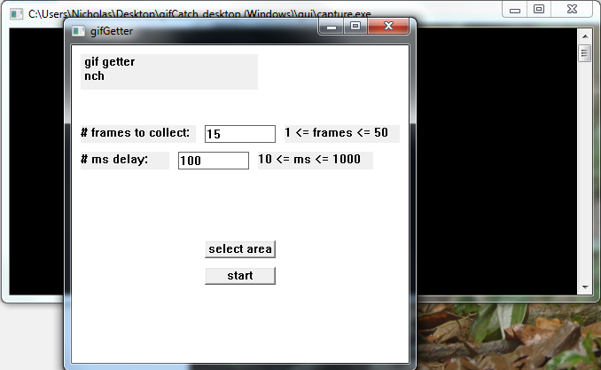
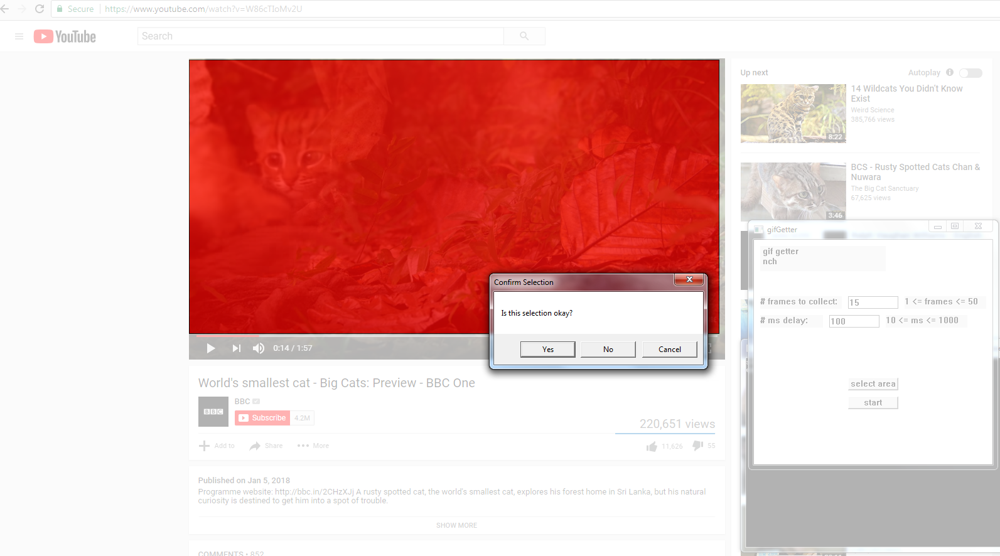

## capture screenshots on your Windows desktop and create a gif!    
    
the program in the gui folder lets you select what part of the screen to screenshot.    
this is still heavily in the works but it has almost at least the minimum functionality.    
right now the gif-making step is handled by the python script, which requires imageio but is extremely easy to install.  also, the gif-making step isn't working out too well either though.      
    
things to do:    
- clean up gui (maybe eventually move to Qt)        
- understand how gifs work    
- can I get better quality images?    
    
thanks to ebonwheeler (https://github.com/ebonwheeler/Win32GrabScreen) for the screen capture code.    
    
current screenshots:    
    
    
    
feel free to check out my Chrome extension that does pretty much the same thing: https://github.com/syncopika/gifCatch_extension    
