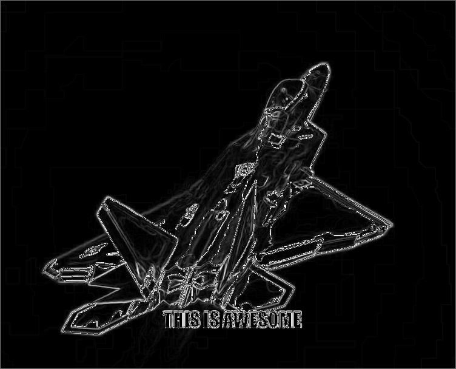

## capture screenshots on your Windows desktop and create a gif!    
    
This application lets you select a part of the screen to screenshot, specify the number of screenshots to take (with adjustable delay between shots), and creates a gif from them.    
Hope it can be useful to someone!    
    
I used MinGW gcc(6.3.0) and MSYS to make/compile this project.    
    
#### this is the current look of the application:     
    
")    
 
There are adjustable settings, such as the <b>number of frames</b>, the <b>time delay between frames</b>, and some <b>color filter choices</b>.  You can choose between red (), blue (), or green () for the selection area screen when choosing a place on the screen to capture.
You can also choose whether or not to capture the screen cursor in your gifs!   
    
For the filters, you can currently adjust the amount of saturation with a float value, change the mosaic filter chunk size with an int value, and change the outline filter's allowable limit for the difference between 2 pixels' color. I have not yet implemented any input validation for these parameters.    
    
Additionally, you can create a gif from a folder of .bmp images (24-bit and 32-bit!) by specifying the full path to a directory. This feature is particularly useful if you have some bmp images that you have edited and want to put them together in a gif.
    
If recreating a gif from pre-collected bmps, you also have the option of adding a caption! (but currently only Impact font is used, with size 32, and placement is near the bottom of the gif, centered)    
But if applying a filter with a caption, the caption will be subject to any effects the filter produces.    
    
things to do:    
- fix up the program structure? i.e. if adding a caption and filter, the caption shouldn't be filtered also.    
- can I get better quality images? different formats (right now it just outputs bmps and uses bmps for gif creation)?    
- allow gif naming / output directory naming?      
- finish parameters/options page    
- remove flickering when dragging selection area screen?    
- more testing / optimize performance?    
- code cleanup
      
- - -    
### adjust the settings to your liking and click on the 'select area' button to choose an area on the screen to screenshot. by default it should capture the whole screen.      
    
     
### select a part of the screen by clicking down anywhere on the screen and dragging.    
    
    
### after clicking the start button, a "processing..." message should appear for each frame    
    
    
### then if everything worked out, a successful processing message should show 
    
    
### you can find the finished gif (will be automatically named the current date and time, i.e. "22-06-2018_095331.gif") in the same folder as the application, as well as its frames in the "temp_[current time]" directory.    
    
    
### here's my result:    
    
This gif uses 30 frames with a delay of 100ms.    
    
### some filters:    
    
    
    
    
This is a single-frame gif showing my Voronoi filter implementation. NOTE: It can get considerably slow for images larger than 500 x 500 pixels based on my experience so far (below that it takes a few seconds per frame).    
    
### with saturation and a caption:    
    
     
check out my Chrome extension that does pretty much the same thing (but is not as neat, and the timing of screenshots is a bit worse I think): https://github.com/syncopika/gifCatch_extension    
    
- - -    
## how it works    
After selecting an area of the screen, the application will take as many screenshots as specified by the number of frames to get as .bmp images and store them in a folder.    
Those images will then be taken and added to the gif (which is when any filter specified is applied as well).    
    
Currently captions are only added if creating a gif from already-captured images. When pulling images from a directory to create a gif, the images are resized first if necessary, with the caption (if any) applied to the resized images. This step creates a new folder of images, regardless if any resizing occurred. Then these images are passed to gif creation step along with any specified filter.    
    
- - -    
## installation
(Assuming you're using Windows) - Make sure to have MinGW installed (should come with all the necessary dependencies like win32 and gdiplus) and MSYS to run `make`. Modify the path to gdiplus based on where your MinGW installation lives in `makefile` in the src/ directory. Then run `make` to build the executable.    
    
- - -    
## acknowledgements
Thanks very much to Philip Goh (https://github.com/cotidian/Win32GrabScreen) for the screen capture code, and Charlie Tangora (https://github.com/ginsweater/gif-h/blob/master/gif.h) for the gif-making code (as well as [rversteegen](https://github.com/rversteegen/gif-h) for their improvements on gif.h, whose fork I'm using currently).    

gifs were taken from this video by Tonkatsu298: https://www.youtube.com/watch?v=D8gwnKApqCE   
