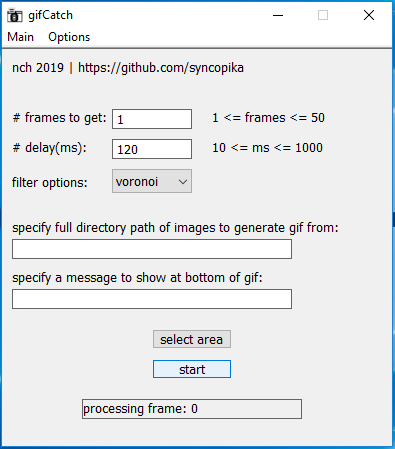

## capture screenshots on your Windows desktop and create a gif!    
    
the executable in the gui folder lets you select what part of the screen to screenshot.    
this is a work-in-progress.     
    
things to do:    
- clean up gui (maybe eventually move to Qt)        
- can I get better quality images? different formats?    
- allow gif naming / output directory naming?    
- different colors for selection screen?    
    
thanks to Philip Goh (https://github.com/cotidian/Win32GrabScreen) for the screen capture code, and Charlie Tangora (https://github.com/ginsweater/gif-h/blob/master/gif.h) for the gif-making code.        
    
current screenshots:    
### adjust the settings to your liking (i.e. number of frames, the time delay between frames) and click on the 'select area' button to choose an area on the screen to screenshot. by default it should capture the whole screen.    
    
     
### screen selection (sorry, only red is available right now)    
    
    
### after clicking the start button, a "processing..." message should appear    
    
    
### then if everything worked out, a successful processing message should show 
    
    
### you can find the finished gif (called "test" - can't choose name yet, sorry!) in the same folder as the program, as well as its frames in the "temp" directory.    
    
    
### here's my result:    
    
    
feel free to check out my Chrome extension that does pretty much the same thing (but is not as neat): https://github.com/syncopika/gifCatch_extension    
