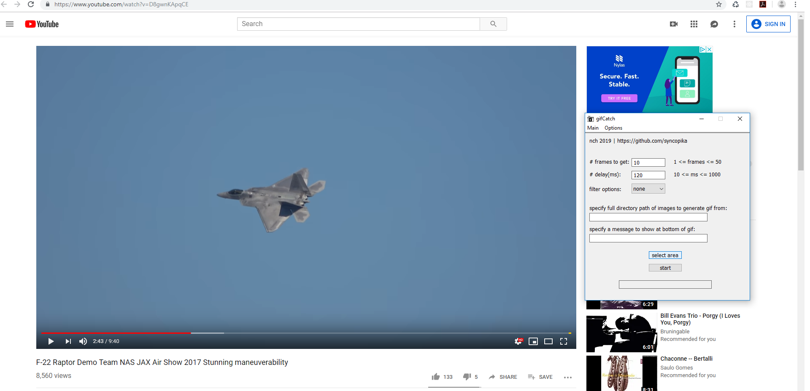

## capture screenshots on your Windows desktop and create a gif!    
    
This application lets you select what part of the screen to screenshot, specify how many screenshots to take with delay, and creates a gif from them.    
I use MinGW gcc(5.3.0) to make/compile this project. Currently a work-in-progress.     
    
#### this is the current look of the application:     
    
 
There are adjustable settings, such as the <b>number of frames</b>, the <b>time delay between frames</b>, and some <b>color filter choices</b>.    

Additionally, you can create a gif from a folder of .bmp images (24-bit and 32-bit!) by specifying the full path to a directory. This feature is particularly useful if you have some bmp images that you have edited (i.e. in MS Paint, which on my machine automatically outputs 24-bit bmps) and want to put them together in a gif.
If recreating a gif from pre-collected bmps, you also have the option of adding a caption! (but currently only Impact font is used, with size 32, and placement is near the bottom of the gif, centered)    
    
things to do:    
- clean up gui (maybe eventually move to Qt?)        
- can I get better quality images? different formats (right now it just outputs bmps and uses bmps for gif creation)?    
- allow gif naming / output directory naming?    
- different colors for selection screen?      
    
thanks to Philip Goh (https://github.com/cotidian/Win32GrabScreen) for the screen capture code, and Charlie Tangora (https://github.com/ginsweater/gif-h/blob/master/gif.h) for the gif-making code.        
    
**screenshots (these show use of an older version of the application, but the functionality is the same):**
### adjust the settings to your liking and click on the 'select area' button to choose an area on the screen to screenshot. by default it should capture the whole screen.      
    
     
### select a part of the screen by clicking down anywhere on the screen and dragging. (sorry, only red is available right now)    
    
    
### after clicking the start button, a "processing..." message should appear    
    
    
### then if everything worked out, a successful processing message should show 
    
    
### you can find the finished gif (will be automatically named the current date and time, i.e. "19-06-2018_200620.gif") in the same folder as the application, as well as its frames in the "temp" directory.    
    
    
### here's my result:    
    
    
### with inversion and saturation filters:    
    
    
    
### with saturation and a caption:    
    
    
gifs were taken from this video by Tonkatsu298: https://www.youtube.com/watch?v=D8gwnKApqCE    

    
feel free to check out my Chrome extension that does pretty much the same thing (but is not as neat, and the timing of screenshots is a bit worse I think): https://github.com/syncopika/gifCatch_extension    
